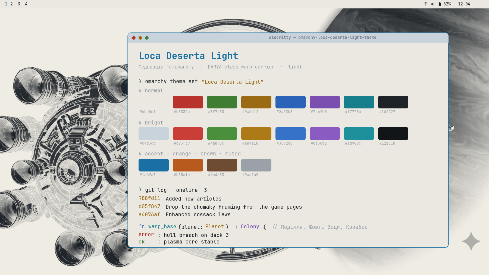

# Loca Deserta Light

An [Omarchy](https://omarchy.org) theme for the far-future **Loca Deserta** universe,
daylight variant: engineering drawings of the DARYA-class warp carrier on paper.



Companion theme: [Loca Deserta Dark](https://github.com/gladimdim/omarchy-loca-deserta-dark-theme).

## Install

```bash
omarchy theme install https://github.com/gladimdim/omarchy-loca-deserta-light-theme.git
omarchy theme set "Loca Deserta Light"
```

## Palette

The dark theme's palette inverted for daylight: hull-white paper, void charcoal text,
and the same plasma, brass, and laser hues deepened for contrast on a light ground.

| Role       | Hex       | Source                    |
|------------|-----------|---------------------------|
| background | `#ebe8e1` | hull white, warm paper    |
| foreground | `#1d2227` | void charcoal             |
| accent     | `#1a6fa3` | deep plasma blue          |
| yellow     | `#9a6b12` | dark brass                |
| orange     | `#b85a1e` | engine burn               |
| red        | `#b8332c` | SHYLO laser               |
| green      | `#3f7d33` | HUD phosphor              |
| cyan       | `#177f8b` | plasma                    |
| blue       | `#2a63b8` | warp ring                 |
| magenta    | `#7b4fb0` | nebula violet             |

Active window borders run a 45° gradient from deep plasma blue to dark brass.

## Backgrounds

DARYA-class ship art from the universe, reworked for a light desktop:

1. `01-darya-ink-on-paper` — technical drawing inverted to ink on warm paper
2. `02-darya-blueprint-white` — the same drawing as blue ink on white
3. `03-darya-core-pale` — the warp core ring, washed toward paper
4. `04-darya-dsrp7-ink` — DSRP-7 drawing as ink on paper
5. `05-darya-sun-pale` — engines against a star, washed toward paper
6. `06-darya-warp-run-pale` — the warp run, washed toward paper

Cycle with `omarchy theme bg next`.

## Credits

Art and universe by Dmytro Gladkyi, from the
[Loca Deserta SciFi](https://github.com/gladimdim/LocaDesertaSciFi) vault.
